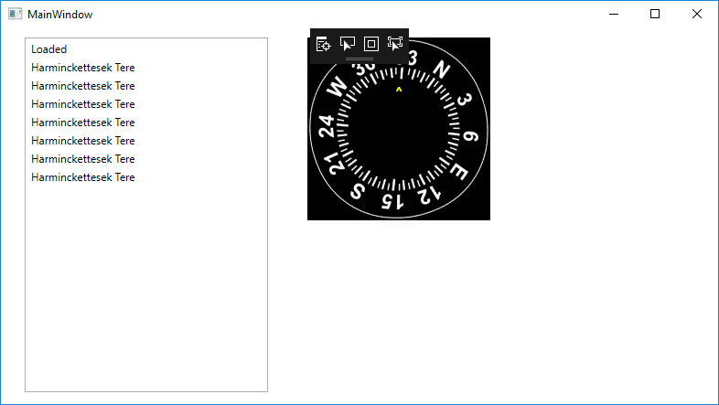

# SayamiSim

UDP Based Flight Simulation Framework for Raspberry Pi Using Elma Event Loop and Process Manager Framework
---

This project is to create a simulation framework using Raspberry Pi. It is a distributed Flight Simulator program where data is sent over UDP to different client computers. The simulation itself is a barebones flight simulator, but it is meant to be improved with flight dynamics at a later date. 

The project will makes use of sensors and actuators (joystick, servo) on a Raspberry Pi using PWM and SPI bus for joystick and servo control. Using the Elma framework, data is transferred to separate receiving processes from the sender process for further consumption. Processes include a system controller (for flight dynamics), joystick controller, servo controller, UDP networking processor and data logger process.

The core idea behind this flight simulator is to have separate hosts that communicate together, not only for multiplayer play, but also as a collaborative flight simulator (where multiple pilots can together fly a plane). In addition, multiple device peripherals (e.g. panels) can listen to the simulator data in a plug-in fashion and display flight data. One can imagine peripherals/panels that run on separate microcontrollers, e.g. a separate airspeed indicator, Comm Radio or HSI. See [here](https://xforcepc.com/english/flight-simulation/saitek-x-plane-peripherals.html) for examples of panels created for the X-Plane simulator. 

With the UDP based communication, and a plugin architecture enabled, we are able to view flight data on different computers. In our case, the simulator itself is running on Raspberry Pi, but data is sent over UDP to a Windows 10 computer that displays the state of the sensors (in our case, the heading of the flight displayed as a compass rose).

UDP P2P client running on Windows (note, UDP multicast was not supported by my router):



The full dynamics of the system will not be simulated at first. Only basic flight characteristics will be simulated (yaw axis, and possibly pitch). The goal is to have the interface defined so that classes can later be swapped out to do more advanced modeling.

The project goals are the following:
- Port Elma Framework to Raspberry Pi and use it as the event loop and process management mechanism
- Interface with a joystick and servo using Raspberry Pi.
    - The interface devices will write to an Elma Channel
- I/O data will be used to display a representation of the current state of the system. Ideally this would be a simulation of an aeroplane cockpit, but due to time constraints on the project and the difficulty of a creating a full fidelity 3D model, the simulation will start as rudimentary 2D simulation using a windowing framework (GTk) and 2D graphics package (Cairo).
- Communicate between processes to disseminate data from one process to another. The interprocess communication should be across different hosts. Listener processes will rely on sensor data to be transmitted and use that data.
- Keep a detailed event log that will be purged periodically based on available capacity. This will be implemented as a separate process.
- Create documentation for the project


Success Criteria:
---
The success criteria for the project are as follows:
- Flight Simulation with Raspberry Pi functional (restricted to X/Y axis with no vertical/horizontal movement)
- Sensor/Actuator input from Raspberry Pi drives simulation
- Sensor data is output in meaningful form.

Installation
---
- Elma: The project requires the [Elma framework](https://github.com/klavinslab/elma/blob/master/README.md), which is an event and process managment framework for embedded devices. Installation instructions for Elma framework can be found [here](https://github.com/klavinslab/elma/blob/master/README.md).

- WiringPi: The project also requires the WiringPi library for interacting with sensors and actuators in Raspberry Pi. The project targets Raspberry Pi 3 devices with the 40 pin connector.

- - WiringPi should be preinstalled with Raspbian images. But if needed, installation instructions can be found at http://wiringpi.com. Details of the installation can be found [here](http://wiringpi.com/download-and-install/).


- Gtk and Cairo: The project UI displays a GUI that is implemented in Gtk3.0 with Cairo graphics library. Gtk3.0 can be installed using the following command line
```
sudo apt-get install libgtk-3-dev
```

- - Gtk3.0 can be installed concurrently with Gtk2.0 (which was the case for me). You also need the Cairo graphics library, which is installed with Gtk (among other dependencies). Cairo graphics library is used by many OS components so it may also already be installed.

- Jsonlib: The project also requires jsonlib from nlohmann. Note that other json classes could be installed on your /usr/local/include or /usr/lib path (which was the case for me). Jsonlib is a single header file that you include in your project (a la #include <json/json.h>); however due to name conflict, I had to rename it to <json/nlohmann_json.h>.

```
#include <json/nlohmann_json.h>
```

Sensors and Actuators Used
---
The project uses Raspberry Pi and sensors. The components used are:
- Joystick (analog)
- Analog to Digital Converter (ADC) - MCP3008
- Servo (SP80)


Milestones
---
Following are the identified milestones for the project:
- Milestone 1: Port Elma library to Raspberry Pi. Expected completion: 3/11/2019 (Completed)
- Milestone 2: Interface a joystick with the Raspberry Pi. Joysticks will output analog data that has to be digitized before consumption with Raspberry Pi. A separate ADC circuit will be needed.  Expected completion: 3/14/2019 (Completed)
- Milestone 3: Interface a servo to Raspberry Pi. Expected completion: 3/15/2019 (Completed)
- Milestone 4: Create UI framework for representing state of the simulator. Expected completion: 3/17/2019 (In Progress)
- Milestone 5: Create processes to communicate simulation state. Initial communication modes will be heading and flight recorder data. Expected completion: 3/19/2019 (In Progress)
- Milestone 6: Integration and Testing. Finish remaning pieces. Expected completion: 3/21/2019
- Documentation: Expected completion: 3/21/2019

Stretch Goals:
- Use UDP to communicate the system data between multiple hosts. (Looking into it)
- Use a Windows program as a UDP listener. Gather the datagrams from the sender and display data on this separate computer. This will demonstrate platform neutrality of the project. Different devices can be used simultaneously via communication using UDP datagrams.

What is Working So Far
---
As of now, the following is functional:
- The sensor inputs to the joystick, ADC and Servo are working. My focus so far has been to get the sensors and actuators working. In the github repo, the 'joystick', 'servo' are standalone programs that work with Raspberry Pi. This part was done standalone but will next be merged to the main project.
- The skeletal code with the basic framework using elma to control the simulator is uploaded under 'project' folder. It is functional. I reprioritized this to be earlier than the graphical UI. Currently, the skeletal code does not hook up to the UI or the actuators. Instead it fakes the data with random values and displays the data as text.
- I also uploaded the current version of the cairo code and ImageTransform folder. ImageTransform folder is my experiments to eventually do a perspective scale on the image. This is very much Work in Progress (WIP). Test.htm file is a sample output from ImageTransform.


