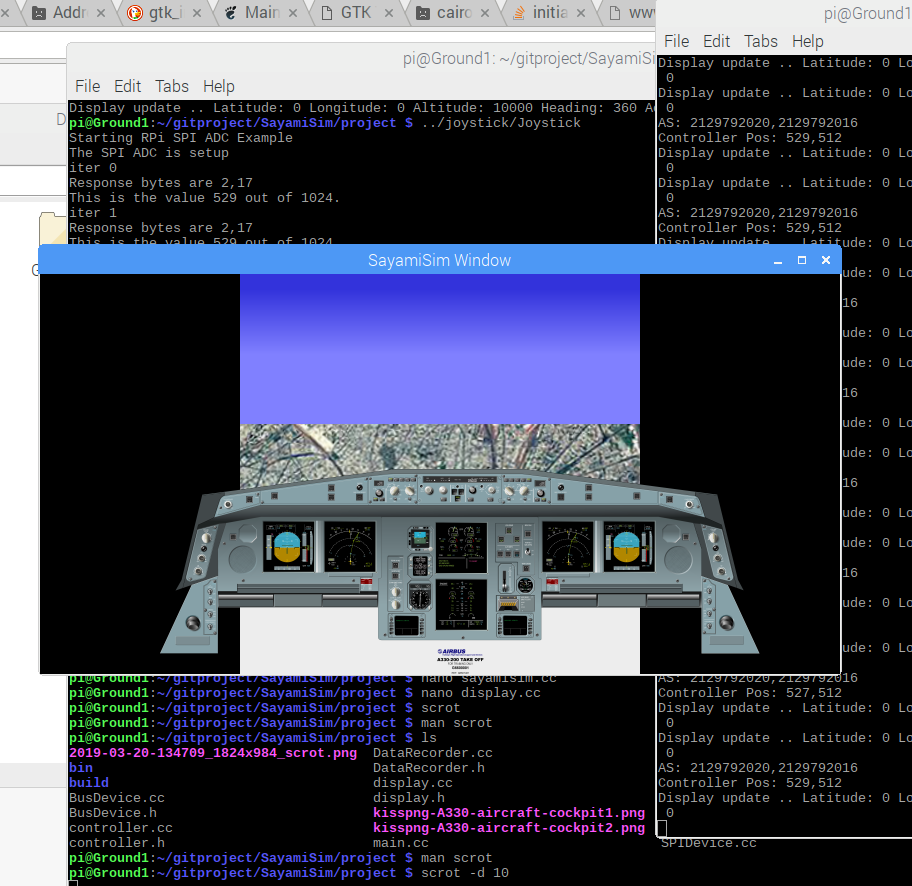

# SayamiSim

UDP Based Flight Simulation Framework for Raspberry Pi Using Elma Event Loop and Process Manager Framework
---

This project is to create a simulation framework using Raspberry Pi. It is a distributed Flight Simulator program where data is sent over UDP to different client computers. The simulation itself is a barebones flight simulator, but it is meant to be improved with flight dynamics at a later date. 

The project makes use of sensors and actuators (joystick, servo) on a Raspberry Pi using PWM and SPI bus for joystick and servo control. Using the Elma framework, data is transferred to separate receiving processes from the sender process for further consumption. Processes include a system controller (for flight dynamics), joystick controller, servo controller, UDP networking processor and data logger process.

The core idea behind this flight simulator is to have separate hosts that communicate together, not only as in traditional multiplayer games, but also as a collaborative flight simulator (where multiple pilots can together fly a plane). In addition, multiple device peripherals (e.g. panels) can listen to the simulator data in a plug-in fashion and display flight data. One can imagine peripherals/panels that run on separate microcontrollers, e.g. a separate airspeed indicator, Communications Radio, ambient sensors, Horizontal Situation Indicator, etc. (HSI). See [here] (https://www.flightsimwebshop.com/en/flightsimulator-modules/auto-pilot-modules/) and [here](https://xforcepc.com/english/flight-simulation/saitek-x-plane-peripherals.html) for examples of panels created for the X-Plane simulator and Microsoft Flight Simulator. 

With the UDP based communication, and a plugin architecture enabled, we are able to view flight data on different computers. In our archetypal example, the simulator itself is running on Raspberry Pi, but data is sent over UDP to a Windows 10 computer that displays the state of the sensors (in our case, the heading of the flight displayed as a compass rose).

UDP P2P client running on Windows (note, UDP multicast was not supported by my router):


The full dynamics of the system will not be simulated at first. Only basic flight characteristics will be simulated (yaw axis, and possibly pitch). The goal is more to have the prototype defined so that classes can later be swapped out to do more advanced modeling.

The project goals are the following:
- Port Elma Framework to Raspberry Pi and use it as the event loop and process management mechanism
- Interface with a joystick and servo using Raspberry Pi.
    - The interface devices will write to an Elma Channel
- I/O data will be used to display a representation of the current state of the flight simulator system. This is a simulation of an aeroplane cockpit, but due to time constraints on the project and the difficulty of a creating a full fidelity 3D model, the simulation will start as rudimentary 2D simulation using a windowing framework (GTk) and 2D graphics package (Cairo).
- Communicate between processes to disseminate data from one process to another. The interprocess communication should be across different hosts. Listener processes will rely on sensor data to be transmitted and use that data.
- Keep a detailed event log that will be purged periodically based on available capacity (Data Recorder, similar to a Flight Data Recorder (FDR)). This will be implemented as a separate process.
- Create documentation for the project


Success Criteria:
---
The success criteria for the project are as follows:
- Flight Simulation with Raspberry Pi functional (restricted to X/Y axis with no vertical/horizontal movement)
- Sensor/Actuator input from Raspberry Pi drives simulation
- Sensor data is output in meaningful form and disseminated to other client computers using UDP (including to multiple operating systems).

Technologies Used (and Limitations):
---
- UI on Raspberry Pi written using Gtk 3.0 and Cairo graphics.
- - Cairo graphics was one of the hardest parts to program. I originally planned to do a perspective scaling to give the effect of 3D. Note that real 3D on the Raspberry Pi is difficult, although there are several projects that have limited capability (or some require a special driver). It seemed like getting 3D working in the timeframe for the project was a no-go. So I decided to write a simple perspective projection just using linear scaling. This works OK in Windows, but on Raspberry Pi and Cairo graphics there were several issues. a) Quite frequently, the graphics would randomly Segmentation Fault. Although easy to repro, it seemed like too much work to debug it without full debugging tools. b) I had to create 3 separate Cairo graphics surfaces for each drawing frame (20+ times per second), and an extra Cairo context as well. Even after disposing of these resoures, the working set quickly grew to over 372MB for the program even at the low frame (10fps) rates I was using initially. It seemed to me that while Cairo graphics was good for most types of UI, it was not suitable for this kind of graphics demand. On Windows, the same program can be made much easier than using Cairo.
- Windows Client app that uses UDP communication was written in WPF. WPF has good and easy interfaces for image manipulation. UDP communication is relatively easy due to prebuilt UDP client classes.

Simulator Screenshot:
---


Project Structure:
---
The /project folder contains the full implementation of the Raspberry Pi portion of the Simulator

The Windows client that listens to UDP datagrams and communicates with the simulator is in the SimulatorListenerUDP.Windows folder.

There are other folders at the root level that are standalone programs I used for experimentation.

The folder SimulatorListenerUDP.Windows holds the Windows UDP client app.

Installation/Compilation Notes:
---
Note that the project can only be compiled in situ in Raspberry Pi (perhaps on a RPi Docker container as well) due to dependency on Gtk and Cairo, among other things. It would be meaningless to compile elsewhere since there are hardware dependencies for the Joystick and Servo, and the pin number assignments for the hardware may not be portable. I cannot make a dependency-less Docker container for this project.

Also note that on my computer, I already had another json library (json.h) in my /usr/local/include/json folder. Therefore I copied the nlohmann json library (which is a single header file) as nlohmann_json.h instead of json.h and changed my elma headers and project headers to include <json/nlohmann_json.h> instead of <json/json.h>. In the Makefile, I defined the $(RPI) variable as a C-define flag to g++ as below. Then in my header files I ifdef'ed the correct json header in case of Raspberry Pi.
```
#Architecture
ARCH := $(shell uname -m)
...
ifeq ($(ARCH),armv7l)
        RPI  := -D_RPI_
else
        RPI  := -D_NOTRPI_
endif

#Flags, Libraries and Includes
CFLAGS      := -ggdb $(RPI)
```

and in the header files:

```
#ifdef _RPI_
#include <json/nlohmann_json.h>
#else
#include <json/json.h>
#endif
```

Library Dependencies:

- Elma: The project requires the [Elma framework](https://github.com/klavinslab/elma/blob/master/README.md), which is an event and process managment framework for embedded devices. Installation instructions for Elma framework can be found [here](https://github.com/klavinslab/elma/blob/master/README.md).

- WiringPi: The project also requires the WiringPi library for interacting with sensors and actuators in Raspberry Pi. The project targets Raspberry Pi 3 devices with the 40 pin connector.

- - WiringPi should be preinstalled with Raspbian images. But if needed, installation instructions can be found at http://wiringpi.com. Details of the installation can be found [here](http://wiringpi.com/download-and-install/).


- Gtk and Cairo: The project UI displays a GUI that is implemented in Gtk3.0 with Cairo graphics library. Gtk3.0 can be installed using the following command line
```
sudo apt-get install libgtk-3-dev
```

- - Gtk3.0 can be installed concurrently with Gtk2.0 (which was the case for me). You also need the Cairo graphics library, which is installed with Gtk (among other dependencies). Cairo graphics library is used by many OS components so it may also already be installed.

- JSON for Modern C++ library: The project also requires this json library from nlohmann (reference at https://github.com/nlohmann/json). Note that other json classes could be installed on your /usr/local/include or /usr/lib path (which was the case for me). This json library is a single header file that you include in your project (a la #include <json/json.h>); however due to name conflict, I had to rename it to <json/nlohmann_json.h>. See note above for more details.

```
#include <json/nlohmann_json.h>
```

Sensors/Actuators Used
---
The project uses Raspberry Pi and sensors. The components used are:
- Joystick (analog)
- Analog to Digital Converter (ADC) - MCP3008
- Servo (SG80)

Hooking Up the Actuators
---
The Joystick needs to be hooked up to the SPI pins on Raspberry Pi (there is only one SPI channel available on Raspberry Pi 3). Not only that, the SPI bus is not enabled by default and can be enabled from raspi-config app. Enabling the SPI bus is a tricky affair (link forthcoming) since it may not always work. However confirm that the files spidev0.0 and spidev0.1 files are present in /dev folder.

The Joystick is an analog device, and since RPi does not have an onboard analog to digital converter (ADC), it has to be digitized before the input is fed to the RPi. Several ADC are suitable for this task such as MCP3008 and MCP3208. I used MCP3008 for this exercise. It has a 10 bit ADC (2^10 or 1024 levels).

Raspberry Pi has PWM output pins. For our Servo, we use the PWM output. There is a calculation you have to do determine the duty cycle. The comments in the code in servo.h/servo.cc walk you through the calculations. I'll add those details here as well later -- forthcoming.

The servo runs like a slave to the joystick. The original idea was based on the disagreement people have (e.g. in the Airbus A320) where the joystick input from one pilot is not mirrored in the joystick of the other pilot (although the aircraft has other methods of warning when there is conflicting input from the two pilots). But at this point it is not that interesting. Since I only used one servo, it runs works in the X-axis direction. Adding the Servo made it a necessity to run with sudo (bummer!).

WiringPI code is used to drive the PWM for the Servo. WiringPI uses memory mapped files for fast output. However, it is software based PWM and not as accurate as one would hope. There is also a lag (in the range of 0.1 sec I would say) before it reaches it desired position, so very fast input to the servo can make it jitter. That is why in my code, the servo actuation is slowed down deliberately.

Pin Assignment for MCP3008 Analog to Digital Converter:
| MCP3008  | RPi Pin  |
|----------|----------|
|          |          |
|          |          |
|          |          |

Pin Assignment for Joystick
| MCP3008  | Joystick Pin  |
|----------|---------------|
|          |               |
|          |               |
|          |               |

Pin Assignment for Servo (SG90)
| Servo  | RPi Pin                     |
|--------|-----------------------------|
|        |         PWM0, Pin12         |
|        |             Gnd             |
|        |   3.3V Vcc via 1K resistor  |

Running the Simulator
---
Make sure to run as sudo. I have found that not running as sudo RELIABLY MAKES THE RASPBERRY PI HANG AND REQUIRE HARD REBOOT. This is because the pwmWrite function in WiringPi library (used by the servo) requires it and hangs at that point. It would be nice to check to see if you are running with sudo, but that is something for another time.
```
sudo ./simulator
```

Network Communication Using UDP:
---
In this simulator, we send datagrams over UDP for communication between machines.

UDP can send data Peer-to-Peer (P2P), with multicast groups, or over broadcast addresses (IPv4 only). I prefer to use the multicast group method since many clients can then listen in (think multiple peripherals such as Radio, Autopilot, etc. as I discussed above). However, it turns out that not all routers are able to use multicast groups and even those that can, may have it disabled by default. See [here](https://www.techwalla.com/articles/how-to-enable-multicast-upnp-technology-on-a-netgear-wndr3300-router) for examples. My NetGear router was not able to use multicast, so I had to end up using P2P, even though I have code written for both P2P and multicast.

The simulator will send UDP datagrams over the network with the state of the simulator, e.g. Altitude, latitude, etc. Other clients can read those messages and do meaningful things with them.

I hardcoded my IP address (192.168.1.20) since this address rarely changes (although it is subject to the DHCP IP address lease timeout), but this is easy to change and I want to make this process more dynamic in the future.

Milestones
---
Following are the identified milestones for the project:
- Milestone 1: Port Elma library to Raspberry Pi. Expected completion: 3/11/2019 (Completed)
- Milestone 2: Interface a joystick with the Raspberry Pi. Joysticks will output analog data that has to be digitized before consumption with Raspberry Pi. A separate ADC circuit will be needed.  Expected completion: 3/14/2019 (Completed)
- Milestone 3: Interface a servo to Raspberry Pi. Expected completion: 3/15/2019 (Completed)
- Milestone 4: Create UI framework for representing state of the simulator. Expected completion: 3/17/2019 (Completed)
- Milestone 5: Create processes to communicate simulation state. Initial communication modes will be heading and flight recorder data. Expected completion: 3/19/2019 (Completed)
- Milestone 6: Integration and Testing. Finish remaning pieces. Expected completion: 3/21/2019 (Completed)
- Documentation: Expected completion: 3/21/2019 (In Progress)

Stretch Goals:
- Use UDP to communicate the system data between multiple hosts. (Accomplished)
- Use a Windows program as a UDP listener. Gather the datagrams from the sender and display data on this separate computer. This will demonstrate platform neutrality of the project. Different devices can be used simultaneously via communication using UDP datagrams (Accomplished)

What is Working So Far
---
__Everything, including the UDP communication (Stretch goals)! Yay!__

As of now, the following is functional:
- The UDP communication using P2P and Multicast is completed
- Windows client app to listen to UDP and display data is completed
- Joystick and Servo are hooked up and functional
- UI for the Simulator in Raspberry Pi (using Cairo and Gtk windowing) is completed
- Data Recorder is completed
- The sensor inputs to the joystick, ADC and Servo are working. My focus so far has been to get the sensors and actuators working. In the github repo, the 'joystick', 'servo' are standalone programs that work with Raspberry Pi. This part was done standalone but will next be merged to the main project.
- The skeletal code with the basic framework using elma to control the simulator is uploaded under 'project' folder. It is functional. I reprioritized this to be earlier than the graphical UI. Currently, the skeletal code does not hook up to the UI or the actuators. Instead it fakes the data with random values and displays the data as text.
- I also uploaded the current version of the cairo code and ImageTransform folder. ImageTransform folder is my experiments to eventually do a perspective scale on the image. This is very much Work in Progress (WIP). Test.htm file is a sample output from ImageTransform.


